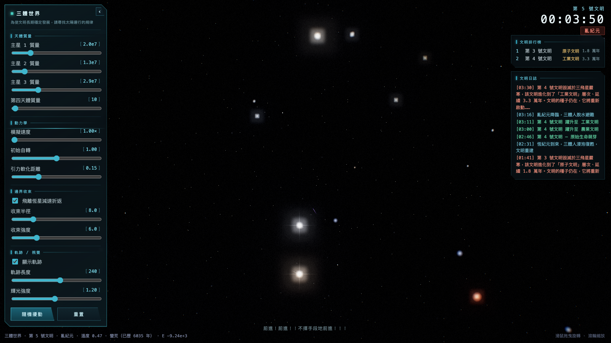

# 三體世界 · Three-Body (Trisolaris)

> 瀏覽器內的三體即時重力模擬 — 融合《三体》小說的文明興衰玩法與寫實太空渲染。

**▶ 線上 Demo：[latteine1217.github.io/three-bodies](https://latteine1217.github.io/three-bodies/)**



三顆不等質量的恆星在混沌的重力場中互相牽引，一顆承載文明的行星在其間漂流。
它的溫度隨恆星遠近劇烈起伏，文明在**恆紀元**中萌芽、於**亂紀元**中脫水蟄伏，
並在烈日、嚴寒、潮汐撕裂與黑暗森林打擊中一次次毀滅、重啟。

純前端、無建置流程、零外部資源（Three.js 由 CDN 載入）。

---

## 特色

- **物理**：PEFRL 四階辛積分 + Plummer 軟化重力；純重力能量漂移 ~0%。三星不等質量、非共面 3D 初始組態 + 隨機初值，自然演化為三體混沌。
- **邊界收束**：所有天體共用同一「彈簧回復力 + 向外阻尼」邊界，飛離者減速折返而非逃逸。
- **寫實渲染**：電漿恆星表面（米粒組織、黑子、邊緣昏暗）、黑體輻射星色、星芒眩光（緩慢閃爍）、程序生成且緩慢自轉的銀河天球、UnrealBloom 與 film grain / 暗角 / 色差 攝影後製。
- **《三体》主題玩法**：行星溫度（含大氣／水體熱慣性）驅動恆／亂紀元；文明歷經**孵化 → 指數加速成長**的六個層級；五種毀滅災難（引力撕裂、巨日、三日凌空、三飛星、黑暗森林打擊）；經典毀滅宣告、文明日誌、歷代排行榜、紀元鐘。
- **Sci-fi HUD**：切角發光外框、掃描光條、模組化讀數、可開合面板，與《三体》三部曲名言輪播。

---

## 快速開始

ES module 需經 HTTP 載入（`file://` 會被 CORS 擋），故需本機伺服器：

```bash
git clone <repo-url> && cd three-bodies
python3 -m http.server 8000
# 瀏覽器開啟 http://localhost:8000/index.html
```

需可連網以載入 Three.js CDN。亦可直接部署到 GitHub Pages（https + CDN、無建置）。

---

## 操作

| 操作 | 動作 |
|------|------|
| 滑鼠拖曳 | 旋轉視角 |
| 滾輪 | 縮放 |
| 左側面板 | 調整質量／速度／自轉／軟化／收束／軌跡／輝光 |
| 「☰／‹」 | 開合控制面板 |
| 單擊右上時鐘 | 開合排行榜／日誌側欄 |
| 隨機擾動 | 在現狀上疊加隨機速度 |
| 重置 | 回到全新隨機初始狀態 |

---

## 專案結構

```
index.html              入口：UI DOM + importmap + 樣式
js/
├── main.js             組裝各模組 + 主迴圈 + 自動重置
├── physics.js          物理核心（PEFRL + Plummer，零 Three.js 依賴）
├── civilization.js     文明模擬（紀元／演化／災難，零 Three.js 依賴）
├── renderer.js         Three.js 場景／天體／軌跡／bloom／後製
├── stars.js            電漿恆星 shader + 星芒眩光貼圖
├── galaxy.js           程序烘焙 equirectangular 銀河貼圖
├── background.js       旋轉銀河天球 + 視差星場 + 遠方裝飾星
├── blackbody.js        黑體輻射溫度 → RGB（純函式）
├── glsl-noise.js       共用 GLSL simplex noise / fbm
└── ui.js              面板綁定 + HUD／日誌／排行榜／時鐘／名言
```

`physics.js` 與 `civilization.js` 不依賴 Three.js，可獨立推理與測試（以 `node` 跑純模組驗證）。

---

## 運作原理

### 物理
- **積分器**：PEFRL（Omelyan-Mryglod-Folk 2002）四階辛積分，每幀 32 子步以解析近距遭遇。
- **重力**：Plummer 軟化 `a = G·m·r/(r²+ε²)^{3/2}`，位能 `U = −G·m₁m₂/√(r²+ε²)` 與力天生一致 → 能量守恆優良。
- **初始組態**：三星沿非共面方向、半徑約 4（含隨機），繞傾斜軸旋轉並疊加隨機初速；行星起於星系內側，與星體共用同一邊界收束（`containR`），可在 `0 ~ containR` 漫遊。

### 渲染
`RenderPass → UnrealBloom → OutputPass(ACES) → 攝影後製(grain/vignette/色差)`
- 恆星：fbm 電漿表面 + 黑子 + 邊緣昏暗；顏色由質量推得色溫經 Planck 黑體決定（放寬以加大變化）。
- 銀河：Canvas 2D 烘焙的 4096×2048 等距柱狀貼圖，貼於緩慢自轉的天球。

### 文明模擬
- **溫度**：行星接收三星輻射通量 → 正規化溫度，再經**大氣／水體熱慣性**緩衝（平滑短暫烈日／寒潮）。
- **紀元**：滑動視窗 + 遲滯緩衝判定恆／亂紀元。
- **文明**：毀滅後需在恆紀元穩定一陣子讓生命**重新演化（孵化）**，之後**指數加速成長**，逐級躍升 `蠻荒 → 農業 → 工業 → 原子 → 資訊 → 星際`。
- **災難**：引力撕裂（流體洛希極限）、巨日、三日凌空、三飛星、黑暗森林打擊（抵星際即座標暴露）、系統崩潰。

---

## 設定與調校

主要常數（`js/physics.js`、`js/civilization.js`）：

| 參數 | 意義 | 預設 |
|------|------|------|
| `containR` | 邊界收束半徑（全體共用） | 8 |
| `DD` | 系統解體安全網半徑 | 20 |
| `ras` | Plummer 軟化長度 ε | 0.15 |
| `THERMAL_TAU` | 行星熱慣性時間常數 | 9 |
| `GROWTH_ACCEL` | 文明指數加速係數 | 0.05 |
| `LIFE_TAU` | 生命孵化期 | 15 |
| `DARK_FOREST_RATE` | 抵星際後遭打擊機率 | 0.012 |

渲染微調見 `renderer.js`（bloom、grain/vignette/色差）、`stars.js`（星芒、表面）、`galaxy.js`（銀河）。

---

## 技術棧

原生 JavaScript ES module ＋ [Three.js](https://threejs.org) r160（CDN）。無打包工具、無相依安裝。

---

## 致謝與授權

- 本專案為**原創實作**：物理、渲染與文明玩法皆為從零撰寫的程式碼。
- 主題、術語與名言**致敬**劉慈欣《三体》三部曲（世界觀與名言著作權屬原作者）。
- 渲染使用 [Three.js](https://threejs.org)（MIT License）。

授權：本專案程式碼採 [MIT License](LICENSE)。

詳細狀態與後續工作見 [STATUS.md](STATUS.md)。
